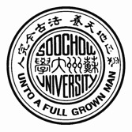
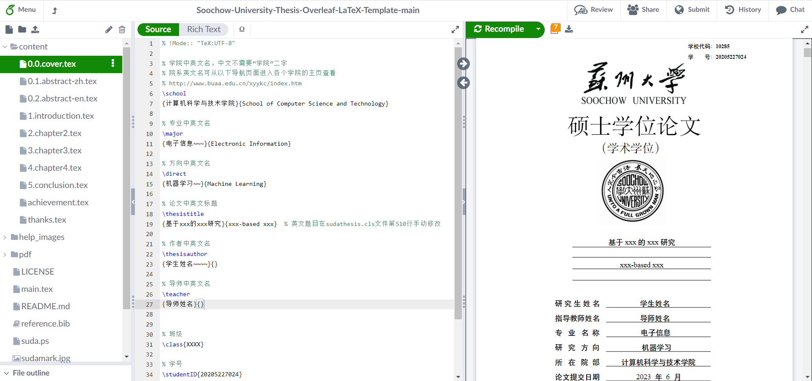
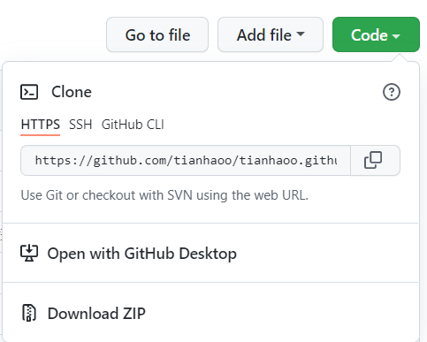
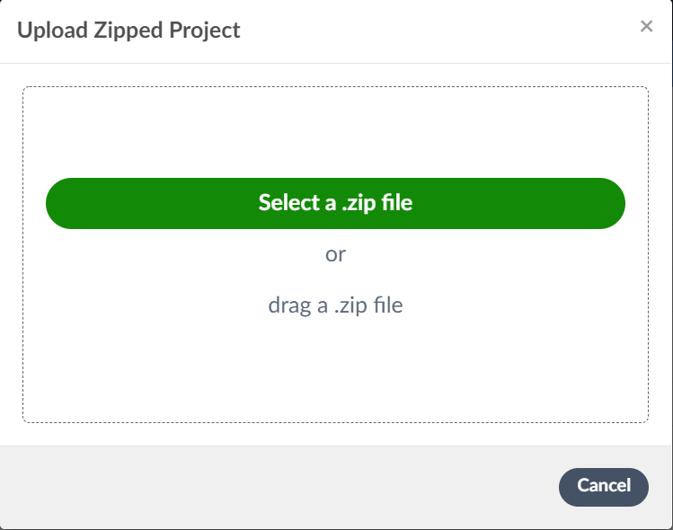
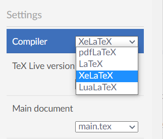

# 苏州大学研究生毕业论文overleaf模板 

Soochow University Thesis Overleaf LaTeX Template 

## 背景

现有的关于苏大毕业论文LaTex模板的内容包括[@huhamhire](https://github.com/maxogden) 的项目[sudathesis](https://github.com/huhamhire/sudathesis)贡献的`sudathesis.cls`文件 和[@hinesboy](https://github.com/hinesboy)的[SUDA-Latex](https://github.com/hinesboy/SUDA-Latex)将其整合后可以在texlive+vscode平台运行的项目。

本项目是在两位学长的基础上修改了部分格式，并对完全跨平台编译做了适配，使之运行在 Overleaf 平台上，如果你有如下的痛点，则可以考虑使用本项目：

* 厌倦了臃肿的本地latex开发环境和被texlive搞乱的系统环境变量

* 新手不会配置vscode，出bug不会调试，要选择老掉牙的自带编辑器`TexWorks editor`

* 修改大论文时各种版本的pdf文件传来传去，在版本对齐中浪费了大量时间，无法多人协作

* 本地latex环境的依赖冲突问题或者其他问题导致编译出现莫名bug

* 在实验室电脑配置了论文环境，对该电脑百般呵护生怕数据丢失，离开实验室后无法在其他设备上写毕业论文

## 安装

1. 在本页面 右上角 `code -> download zip`

2. 在`overleaf.com` 中 `New Project -> Upload Project -> select a .zip file`, 上传刚才下载的zip文件

3. 在左上角 `Menu -> Compiler` 中选择编译器为XeLaTex， 然后右上角ReCompile

4. 初次编译速度较慢，后续再编译速度会提升。

### 使用说明

1. 在`content`文件夹中修改相应章节的内容

2. `main.tex`规定文章结构

3. `reference.bib`里面是参考文献

### 进阶

1. 本项目中使用的宋体为FandolSong，楷体为FandolKai，均为Overleaf支持的字体

如果对目前的字体不满意可以从下面列表中寻找由Overleaf支持的字体

[Overleaf支持的字体列表](https://www.overleaf.com/learn/latex/Questions/Which_OTF_or_TTF_fonts_are_supported_via_fontspec%3F#!CJK)

也可以自行上传其他字体

[在overleaf中添加其他字体的方式](https://www.overleaf.com/learn/latex/XeLaTeX)

2. 如果 a)对overleaf.com网站的编译速度有要求 b)对文章内容隐私性有要求 c)梯子不快的同学，可以考虑在内网的强悍服务器上搭建一个本地的Overleaf平台，现已支持docker

[Overleaf - A web-based collaborative LaTeX editor](https://github.com/overleaf/overleaf)

## 相关仓库

- [sudathesis](https://github.com/huhamhire/sudathesis) — LaTeX template for bachelor's thesis in Soochow University
- [SUDA-Latex](https://github.com/hinesboy/SUDA-Latex) — 苏州大学-硕士毕业大论文-Latex模版（附安装使用说明）

## 维护者

[@tianhaoo](https://github.com/tianhaoo)。

## 如何贡献

非常欢迎你的加入！[提一个 Issue](https://github.com/tianhaoo/Soochow-University-Thesis-Overleaf-LaTeX-Template/issues) 或者提交一个 Pull Request。

标准 Readme 遵循 [Contributor Covenant](http://contributor-covenant.org/version/1/3/0/) 行为规范。

## 使用许可

[MIT](LICENSE) © Tianhaoo

